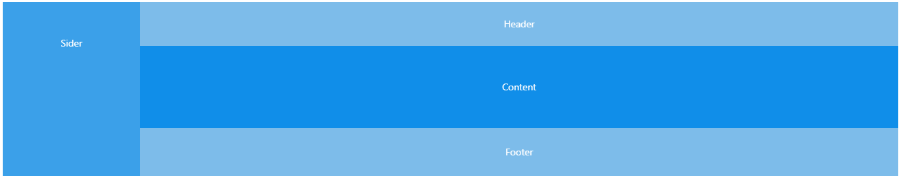
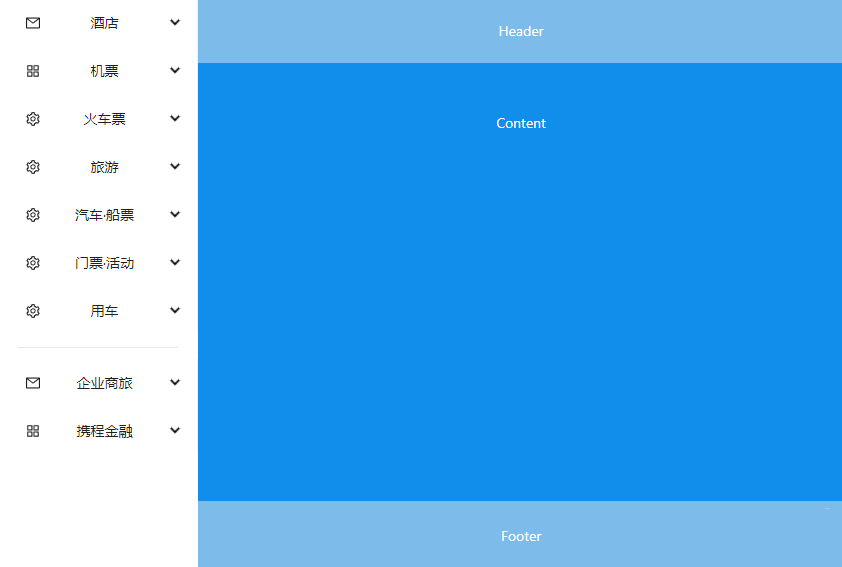
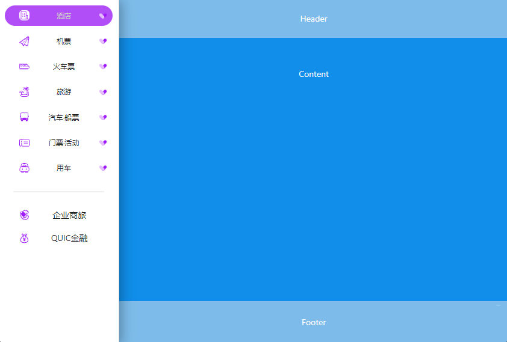

## 静态页面与交互实现细节 🤝

#####作者：宣正吉
**梗概：** 包含静态页面组织的组件和外观设计、图片设计和优化等内容细节，也包含具体的时间安排。

---

### 时间节点

**4/10~4/13** 完成所有静态页面的编写和设计，根据功能与需求分析文档，需要完成主页面基础组件 + 固定页面、主要功能页面、附加功能页面几个部分，工作时间分配大致安排：

| 时间分配 |      具体时段      |         完成内容          |                     包含的页面内容                     |
| :------: | :----------------: | :-----------------------: | :----------------------------------------------------: |
|   2 天   |  4/11 日~4/12 日   | 主页面基础组件 + 固定页面 | 侧边导航栏 + 顶部功能栏 + 登录窗口 + 信息栏 + 无效链接 |
|   2 天   |  4/13 日~4/14 日   |       主要功能页面        |                  酒店 + 火车票 + 旅游                  |
|  1~2 天  | 4/14 ~ **4/15** 日 |       附加功能页面        |             机票 + 汽车票·船票 + 我的订单              |

### 基础组件 + 固定页面

脚手架采用`next.js`的初始化方案`npx create-next-app@latest`，执行`npm run dev`在开发环境下运行，且该脚手架支持`tailwindcss`，非常方便。

#### 侧边导航栏

这个部分实际上要搭配右侧内容宽度进行布局，因此需要先用 antd 做整体布局效果，选择 antd 中已经存在的布局，利用 `vh` 做全屏伸缩布局：

左侧是导航栏，右侧是内容区域。

左侧导航栏用既有组件`Menu`实现，组件在 sider 文件夹的`sider.js`中，共有 9 个一级标签页，二级标签页内容暂时待定，可从后台 mock 数据当中抽取。每个标签页都有独立的`id`属性，这部分数据后面在实现功能的过程中还可以抽取数据，用代码生成，所以不用写太多假数据，实现效果：

 **好奇功能：** 似乎导航栏利用的不是 antd 组件，是怎么实现的呢？

导航栏中的图标采用阿里巴巴矢量图标库`iconfont`实现，`antd`支持引入网络 icon，可以链接阿里巴巴图标库进行开发。
实现效果：

导航栏上方设计一个按钮，点击按钮，整个菜单会折叠成简约版本，鼠标移入则展开成完全版本。可以通过`antd`中的收起内嵌菜单实现，只需要修改`Menu`组件的一个参数和添加一个控制折叠的 js 代码即可。
